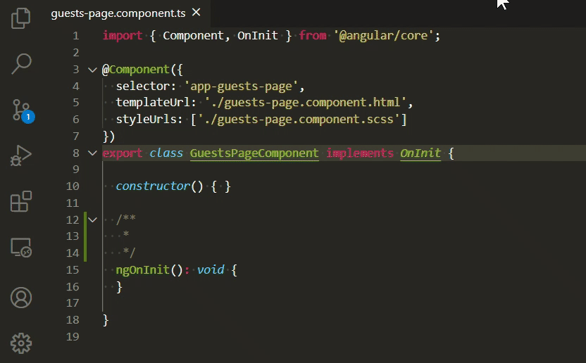

# change-tab-size

Changes the tab size of the opened file to follow the global tab size specified in the global settings.

Works best with:
- `editor.tabSize` specified to a value that you are comfortable with.
- `editor.detectIndentation` set to true, so VSCode can guess the estimated tab size.

## Commands

- `changeTabSize.followDefault`
    - Change to default in global settings

## Extension Settings

- `changeTabSize.activateOnLanguages`
    - Automatically run the change tab size command when files with the specified [language identifiers](https://code.visualstudio.com/docs/languages/identifiers#_known-language-identifiers) are active.
    - Defaults to an empty array.

## Release Notes

Please check [CHANGELOG.md](./CHANGELOG.md)
